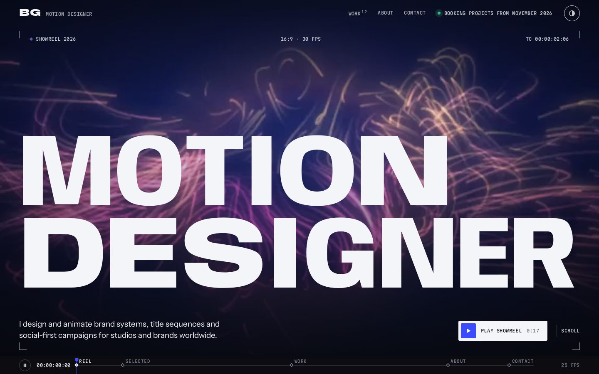

# BG — Motion portfolio

A portfolio site for motion designers who deliver in both **16:9** and **9:16**.
It's plain HTML, CSS and JavaScript with no build step and no dependencies, so it can be hosted anywhere static files are served (GitHub Pages, Netlify, Vercel, your own server).



The page works like a composition on a timeline. Your scroll position is a playhead, each section is a keyframe on the bar at the bottom, and every clip shows its format, frame rate and timecode.

## What's in it

- **Hero showreel.** A muted loop plays full-bleed behind a variable-font title whose letters stretch toward the cursor. On phones held upright it switches to your vertical reel. "Play showreel" opens the reel with sound.
- **Selected work.** A horizontal reel of highlights that scrolls sideways as you scroll down on desktop, and becomes a swipeable carousel on phones. 16:9 and 9:16 pieces sit side by side at matching heights.
- **All work grid.** A masonry grid built for mixed formats: 16:9 clips span two columns and vertical clips fill the gaps. Hovering a thumbnail plays its preview loop with a progress line; on phones, the clip in the middle of the screen plays.
- **Filters.** Discipline chips (built automatically from your categories, with After Effects label colors), a format filter (All / 16:9 / 9:16), and a **Grid ↔ Index** toggle. The index is a sortable list with a preview that follows the cursor.
- **Project viewer.** Opens as a full-screen page with a shareable link (`yoursite.com/#project-slug`). The thumbnail morphs into the player. It includes a custom player with SMPTE timecode at the project's frame rate, frame stepping, scrubbing, fullscreen and keyboard shortcuts, plus the project's details, credits and a "Next project" link. Vimeo and YouTube embeds work too.
- **About and contact.** A statement whose words light up as you scroll, lists of services, tools and clients, a copy-email button, live local time and availability.
- **Timeline bar.** Shows the scroll position as a timecode. Click a keyframe to jump to that section, or drag along the bar to scrub through the page. Its pause button stops everything that moves by itself (background reels, the moving title, the scrolling band).
- **Dark and light themes** with a toggle. Film grain textures the background but never your videos.
- **Accessibility and performance.** Respects reduced motion (no autoplay, no parallax) and Data Saver. Videos load only when needed and pause off-screen. Full keyboard support and visible focus states.

## Quick start

1. Open `index.html` in a browser to see the sample site. For the most accurate preview, run a local server from this folder:
   ```bash
   npx serve .
   ```
   Avoid `python -m http.server`: it doesn't support range requests, so Safari won't play the videos.
2. Edit **`content.js`**. It's the only file you need to touch. Your name, reel, projects, about text and contact details all live there.
3. Replace the sample clips in `media/` with your own (see below), then delete the sample folders you no longer use.

## Adding your videos, step by step

You only do steps 1–2 once.

1. **Install ffmpeg.** On a Mac: install [Homebrew](https://brew.sh), then run `brew install ffmpeg` in Terminal. On Windows: run `winget install Gyan.FFmpeg` in PowerShell, then install [Git for Windows](https://git-scm.com/download/win), which includes **Git Bash**.
2. **Get your site on your computer.** On your repository's page on GitHub, click **Code → Download ZIP** and unzip it, or open it with GitHub Desktop.
3. **Open a terminal in the site folder.** On a Mac, right-click the folder and choose **New Terminal at Folder**. On Windows, right-click the folder and choose **Open Git Bash here**.
4. **Encode your whole videos folder in one go.** Type `bash tools/encode.sh `, then drag your videos folder onto the terminal window so its path is filled in, and press Enter:
   ```bash
   bash tools/encode.sh "/Users/you/Desktop/videos portfolio"
   ```
   Every video inside (MOV, MP4, ProRes…) becomes a web-ready set in `media/<name>/`. A ready-made block for each one is saved in `tools/new-projects.txt`. Run it again after adding more videos: the ones already done are skipped.
5. **Describe your projects.** Open `content.js` in a code editor such as [VS Code](https://code.visualstudio.com) (free). Don't use TextEdit or Word, which turn `"` into curly quotes and break the file. Delete the sample projects and paste in the blocks from `tools/new-projects.txt`. For each project, fill in the title, client, categories, summary and so on.
6. **Pick your highlights and reel.** Put your best slugs in `highlights`. Encode your showreel with its own name, for example `bash tools/encode.sh ~/Renders/showreel.mov my-showreel`, but don't paste its block into the projects. Instead, in `content.js` under `hero.reel`:
   - set `video: "media/my-showreel/video.mp4"` and `poster: "media/my-showreel/poster.jpg"`, and copy `duration` and `fps` from its block;
   - if you also have a 9:16 cut, encode it the same way (for example as `my-showreel-vertical`) and point `videoVertical`, `posterVertical` and `durationVertical` at it. If you don't, set `videoVertical: ""` and `posterVertical: ""`, and phones will use your 16:9 reel.
7. **Check it.** Double-click `index.html`. If you see a yellow message saying `content.js` could not be read, there's a typo in it (usually curly quotes or a missing comma). Press F12 (Cmd+Option+J on a Mac) and the Console names the line.
8. **Upload.** On your repository on GitHub:
   - on the main page, click **Add file → Upload files**, drag in `content.js`, and click **Commit changes**;
   - then open the `media` folder, click **Add file → Upload files** there, drag in your new project folders, and click **Commit changes**. Folders dropped on the main page land outside `media/`, and their videos won't load.

   The web uploader takes up to 100 files at a time, 25 MB each. For bigger videos, use GitHub Desktop (up to 100 MB per file), or host the full video on Vimeo (see below). Sample folders you no longer use can stay: anything not listed in `content.js` isn't shown. To delete them, use GitHub Desktop or delete their files on GitHub.

## Reference

### Encoding options

`tools/encode.sh` turns master renders into web-ready files. It accepts a folder, several files, or one file plus the link name you want:

```bash
bash tools/encode.sh ~/Desktop/"videos portfolio"          # every video in the folder
bash tools/encode.sh ~/Renders/Halden_Ident_v12.mov halden-ident
```

The script remembers which master made each folder (in `tools/encoded.txt`, which stays on your computer). Re-running it after adding videos only encodes the new ones, and `tools/new-projects.txt` always lists every video from the last run.

For each video it creates `media/<slug>/` containing:

| File | What it is | Typical size |
| --- | --- | --- |
| `video.mp4` | Full clip for the viewer. H.264, 1080p max, sound kept | 5–20 MB per 30 s |
| `preview.mp4` | Silent 6-second loop at 960px for hover previews | 0.5–2 MB |
| `poster.jpg` | Still frame shown before playback | 100–250 KB |

Each project's block has the format, duration, frame rate and dominant color already filled in.

Options go before the command. `POSTER_AT=4` picks the poster frame (seconds), `PREVIEW_START=3 PREVIEW_LEN=6` picks the preview loop, `CRF=20` raises quality (lower number = better and larger), and `FORCE=1` re-encodes videos that were already done. Link names the page uses for its own sections (`work`, `about`, `contact`…) get `-project` added. For example:

```bash
POSTER_AT=4 CRF=20 bash tools/encode.sh ~/Desktop/"videos portfolio"
```

### Project fields in `content.js`

```js
{
  slug: "signal-bloom",              // used in the link: yoursite.com/#signal-bloom
  title: "Signal Bloom",
  client: "Halden Audio",
  year: 2026,
  format: "16:9",                    // or "9:16" (any ratio like "4:5" also works)
  categories: ["Brand", "3D"],       // filter chips are built from these
  featured: true,                    // optional: include in "Selected work"
  video: "media/signal-bloom/video.mp4",
  preview: "media/signal-bloom/preview.mp4",
  poster: "media/signal-bloom/poster.jpg",
  duration: "0:32",
  fps: 25,                           // the viewer's timecode uses this
  color: "#141a3a",                  // shown while the poster loads
  summary: "One-line description shown in the viewer.",
  description: ["Paragraph one.", "Paragraph two."],
  role: "Direction, design, animation",
  tools: ["Houdini", "Redshift", "After Effects"],
  credits: [{ role: "Sound design", name: "Arcos Audio" }],
  links: [{ label: "Case study on Behance", url: "https://www.behance.net/..." }]
}
```

Only `title`, `format` and `video` (or `vimeo` / `youtube`) are required. Projects appear in the grid in the order you list them. Set `hidden: true` to keep a project in the file but off the site. Each `slug` must be unique and must not be `top`, `highlights`, `work`, `about` or `contact`, because those are the page's own sections.

**Selected work** uses the `highlights` list of slugs, in that order. If that list is empty, it uses every project marked `featured: true`.

**Hero reel.** Set `hero.reel.video` (a muted 16:9 loop behind the title), and optionally `videoVertical` (a 9:16 loop for phones held upright). If you have a longer cut with sound for the "Play showreel" button, set it as `full`, and `fullVertical` for phones. Set `duration` (and `durationVertical`) to the length of what the button plays.

### Hosting large videos elsewhere

GitHub rejects single files over 100 MB, and Pages sites should stay under 1 GB in total. The encoder defaults keep most pieces well under that. For long films you have three options:

- Put a full URL in `video`, e.g. a file on Cloudflare R2, Bunny or S3 (`video: "https://cdn.example.com/reel.mp4"`).
- Set `vimeo` or `youtube` to the video's ID or just paste its link (unlisted Vimeo links work too). When set, the viewer embeds that player instead of `video`, and your hover preview still comes from `preview`.
- Keep `preview` and `poster` in this repo either way, so the grid stays fast.

## Publishing on GitHub Pages

1. Push this folder to a GitHub repository (this one works as is).
2. On GitHub, open **Settings → Pages**.
3. Under **Build and deployment**, choose **Deploy from a branch**, select `main` and `/ (root)`, then **Save**.
4. After a minute your site is live at `https://<username>.github.io/<repository>/`.

For a custom domain, add it on the same Settings page and point your DNS at GitHub as it describes. The empty `.nojekyll` file tells Pages to serve the files as they are.

Before publishing, update the `<title>`, `description` and `og:` tags at the top of `index.html`. They control how your link looks when shared.

**Other hosts:** on Netlify or Vercel, drag this folder into a new project. There's no build command and the output folder is the root.

## Customising

- **Colors.** All colors are tokens at the top of `assets/css/main.css`: the dark palette on `:root` and the light palette below it. `--accent` is the playhead blue used for progress, the play button and active states.
- **Default theme.** Set `site.theme` in `content.js` to `"dark"`, `"light"` or `"auto"` (follows the visitor's system). Visitors can still switch with the toggle, and their choice is remembered.
- **Fonts.** The site uses [Anybody](https://fonts.google.com/specimen/Anybody) for display type (its width axis drives the kinetic titles), [Instrument Sans](https://fonts.google.com/specimen/Instrument+Sans) for text and [Martian Mono](https://fonts.google.com/specimen/Martian+Mono) for timecodes and labels. Change the Google Fonts link in `index.html` and the `--f-*` tokens in the CSS. The kinetic titles need a variable font with a `wdth` axis.
- **Category colors.** Chips use After Effects label colors in order. To choose your own, add `categoryColors: { "3D": "#e5bcc9" }` to `content.js`.
- **Text.** The hero title lines, intro, marquee words, about statement, lists and contact heading are all in `content.js`.

## Keyboard shortcuts in the viewer

| Key | Action |
| --- | --- |
| `Space` / `K` | Play / pause |
| `←` `→` | Back / forward 5 seconds |
| `,` `.` | Step one frame back / forward |
| `[` `]` | Previous / next project |
| `F` | Fullscreen |
| `M` | Mute |
| `Esc` | Close |

Visitors can pause all background motion with the pause button at the left of the timeline bar. Their choice is remembered. Anyone whose system asks for reduced motion gets a still page automatically.

## Files

```
index.html             page shell and meta tags
content.js             ← your content
assets/css/main.css    all styles; color tokens at the top
assets/js/main.js      rendering, grid, viewer, animations (no libraries)
media/                 videos, previews and posters, one folder per project
tools/encode.sh        ffmpeg helper for your masters
tools/new-projects.txt blocks written by encode.sh, ready to paste (created when you run it)
docs/preview.jpg       screenshot used in this README
```

The sample projects, clients and credits are fictional, and the sample clips are generated placeholders. Replace them before you publish.
